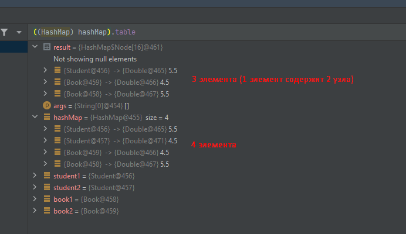

## Task 1

Для запуска программы необходимо запустить метод `main()` класса [Main](src/Main.java)

В ходе выполнения задания было создано 2 класса [Student](src/Student.java) и [Book](src/Book.java),
у которых были переопределенны методы `equals()` и `hashCode()`.

У класса [Book](src/Student.java) методы были переопределенны при помощи инструментов IntelliJ IDEA,
а у класса [Student](src/Student.java) метод `hashCode()` был реализован таким образом, что он всегда
возвращает число, равное остатку от деления поля `age` на 10. Это позволяет легко смоделировать ситуацию,
когда у 2 объектов равен `hashCode`, но объекты не равно по `equals`.

Все 4 объекта поместил в коллекцию HashMap, и в режиме дебага посмотрел на содержимое переменной `table`.

Оказалось, что внутри переменной `table`, создалось 3 бакета, для 4 элементов. Так как 2 объекта с
одинаковыми хэш-кодами поместились в один бакет.

---
__\*__ При использовании `HashTable` вместо `HashMap` отличий в дебаге не замечено. Из документации узнал,
что

| Feature                       |     HashTable     |     HashMap     |
|-------------------------------|:-----------------:|:---------------:|
| Allows `null` as key or value |         -         |        +        |
| Thread-safe                   |         +         |        -        |
| Iterating                     | Uses `Enumerator` | Uses `Iterator` |

`HashTable` уже давно deprecated коллекция. Ее аналогом является `ConcurrentHashMap`